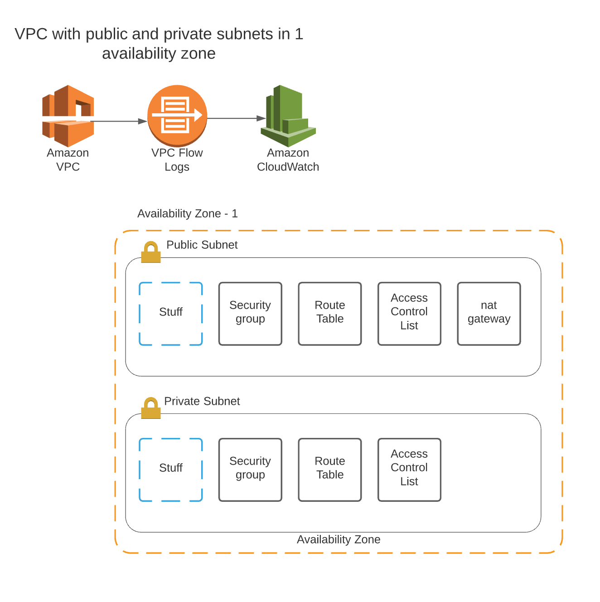

# Virtual Private Cloud (VPC)

Virtual Private Clouds are network encapsulations in AWS that allow
users to isolate resources within private networks, and manage security
and access rules as well as monitor traffic.

This module will create two subnets, one public one private. Resources deployed into the 
public subnet will be routable publicly, and things deployed in the private subnet will only be reachable by things in the public subnet.

